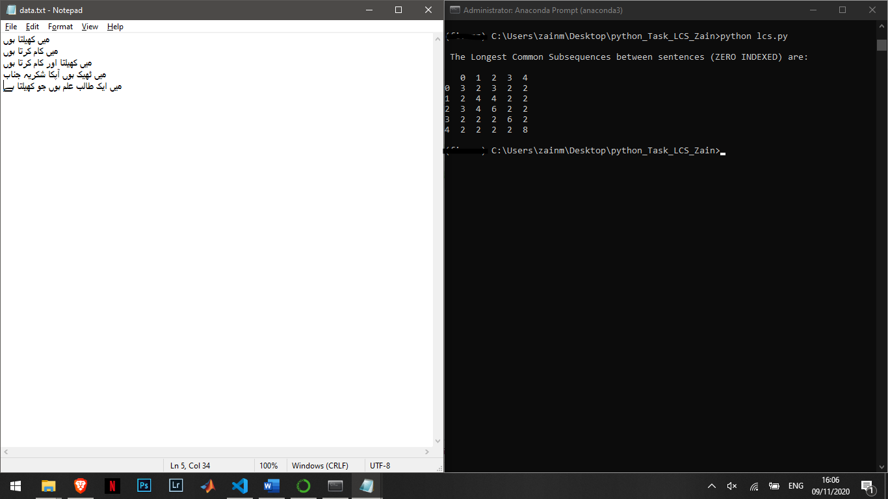

# Longest Common Subsequence
This repository contains python implementation for calculating Longest Common Subsequences (LSC) between tokenized URDU sentences.

## Honor Code
I am leaving this open source on the honor system. My implementation works for the preprocessed urdu data (1 sentence per line) as I used "\n" as my delimiter while extracting sentences. I was having issues with lengths of sentences while trying with "۔" delimiter. If you find a fix, feel free to contribute. Thanks.

## Overview
The longest common subsequence (LCS) is defined as the longest subsequence that is common to all the given sequences, provided that the elements of the subsequence are not required to occupy consecutive positions within the original sequences. This repository contains the notebook and scripted implementation of calculating LCS by reading the raw urdu ttext file and showing the final LCS matrix on the console. The script use a naive and recurrent implementation of LCS Algorithm.

The input text file and the LCS output is shown below:

